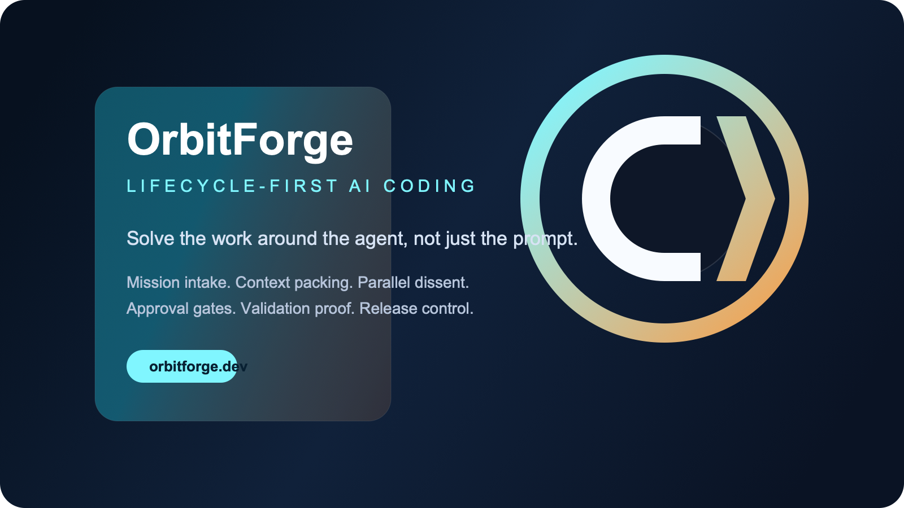

# OrbitForge VS Code Extension



OrbitForge brings the lifecycle-first OrbitForge experience into VS Code.

Instead of stopping at chat and code generation, OrbitForge helps you run work with:

- a guided session flow that feels closer to Claude Code and Codex than a static command list
- mission history that keeps good runs close enough to restore or rerun in one click
- slash commands that reconfigure the session without leaving the panel
- live run logs so you can see context packing, lane setup, and completion stages
- streaming-style output playback inside the panel
- pinned presets for instant repeatable missions
- multi-mission session tabs inside the panel
- exportable mission history to markdown or JSON
- built-in diff proposals and git branch scaffolding from the mission prompt
- true provider streaming for single and parallel lanes when supported
- provider parity across local and hosted models
- parallel architect / implementer / critic lanes
- workflow-aware mission boards
- starter blueprints for review, migration, incident, and release work
- portable lifecycle contracts that also work in the OrbitForge CLI

## Why Install OrbitForge

Most coding extensions help you prompt a model.

OrbitForge is built for the harder problems:

- moving between local and hosted providers without changing your workflow
- making risky changes with structured disagreement instead of one overconfident answer
- keeping context visible when a task spans editor, CLI, and release decisions
- turning agent runs into something that is easier to review, validate, and ship

## Features

- `OrbitForge: Guided Session`
  Opens a low-friction launcher that lets you choose a preset, custom mission, or starter blueprint in a few clicks.
- `OrbitForge: Mission History`
  Opens saved workspace missions so you can rerun or continue strong prior runs.
- `OrbitForge: Export Mission History`
  Exports mission history to a markdown or JSON file.
- `OrbitForge: Propose Patch Diff`
  Generates a diff proposal for a chosen file and opens a VS Code diff view.
- `OrbitForge: Create Git Branch`
  Builds a branch + commit scaffold from your mission prompt.
- `OrbitForge: Open Panel`
  Opens the interactive OrbitForge panel with presets, pinned missions, session tabs, slash commands, a mission timeline, streaming output, history, and blueprint launching.
- `OrbitForge: Explain Selection`
  Reviews the current selection and suggests the safest next edit.
- `OrbitForge: Plan From Workspace`
  Summarizes the workspace and asks OrbitForge for the next implementation plan.
- `OrbitForge: Parallel Workspace Plan`
  Runs the built-in architect / implementer / critic trio for a release-oriented plan.
- `OrbitForge: Run Starter Blueprint`
  Launches a built-in lifecycle blueprint directly in the current workspace.
- `OrbitForge: Run Blueprint File`
  Runs a JSON blueprint exported from the OrbitForge ecosystem builder or CLI.

## Supported Providers

- Ollama
- LM Studio
- OpenAI
- Anthropic
- OpenRouter
- OpenAI-compatible endpoints

## Ecosystem Blueprints

OrbitForge now supports open lifecycle blueprints.

That means the same flow can be:

- designed visually in the private hosted OrbitForge builder
- committed as plain JSON in git
- run in the CLI
- executed inside this VS Code extension

Starter blueprints currently include:

- Parallel Review Kit
- Migration Flight Plan

## Install

### From Marketplace

Once published, install `OrbitForge` from the VS Code Marketplace or Open VSX.

### From VSIX

```bash
code --install-extension orbitforge-vscode-0.8.0.vsix
```

## Configure

Open VS Code Settings and search for `OrbitForge`.

Important settings:

- `orbitforge.provider`
- `orbitforge.baseUrl`
- `orbitforge.model`
- `orbitforge.apiKey`
- `orbitforge.agentMode`
- `orbitforge.workflow`
- `orbitforge.stream`

## Interactive Flow

The fastest way to use OrbitForge now is:

1. Run `OrbitForge: Guided Session`
2. Pick a preset, history entry, blueprint, or custom mission
3. Use `OrbitForge: Open Panel` when you want the always-on workspace

Inside the panel, you can type slash commands like:

- `/help`
- `/preset parallel-release`
- `/workflow review`
- `/scope selection`
- `/blueprint parallel-review-kit`
- `/history`
- `/rerun last`
- `/pin workspace-plan`
- `/pins`
- `/export md`
- `/export json`
- `/branch add-release-gate`
- `/diff src/app.tsx`

## Development

```bash
npm install
npm run build:extension
npm run package:extension
```

## Support

See [SUPPORT.md](./SUPPORT.md) for issue reporting and release questions.
